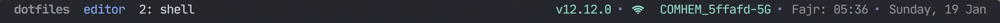

# Ahmed’s dotfiles

> Running [**iTerm2**](https://www.iterm2.com/) with custom [**Spaceship-zsh**](https://github.com/denysdovhan/spaceship-zsh-theme) theme.

The color scheme is [**Aylin**](https://github.com/AhmedAbdulrahman/aylin-iterm-theme) for _iTerm2_ and the font is [**Recursive**](https://www.recursive.design/) with [**DroidSansMono Nerd Font**](https://github.com/ryanoasis/nerd-fonts) as Non-ASCII Font


## What's in it?
This is where I keep all my configs and automated scripts for Mac setup including:
- [`Homebrew`](https://brew.sh/): used to Manage and Installing most of the macOS dependencies and [`Cask`](https://github.com/caskroom/homebrew-cask) for installing GUI apps like Chrome, Firefox, VSCode,...etc.
- [`Tmux`](http://tmux.sourceforge.net/)
  
- [`Neovim`](https://neovim.io)
- [`ZSH`](http://www.zsh.org/) with various customization:
  - [`🚀Spaceships ZSH`](https://github.com/denysdovhan/spaceship-prompt) as a prompt.
  - [`🌺ZPLUG`](https://zplug.sh) for dependency management.
  - ⚡️ Power up and beautify terminal with ZSH completions.
  - 💄 Syntax highlighting of commands.
  - ⌨️  Autosuggestions for most of commands.
  - 🕵️‍ Fuzzy Finder for VIM, Git and ZSH
  - 🏎 ZSH [`VIM`](./zsh/config/mappings.zsh) bindings for VIM nerds.
  - 🏎 Useful [`aliases`](./zsh/config/aliases.zsh).
  - 🛠 [`Git config`](./files/.gitconfig), global [`.gitignore`](./files/.config/git/.gitignore) file and aliases.

Missing feature? 🍴 Fork this repo and make it better ❤️

# Getting Started with Ahmed's dotfiles
This guide will take you through setting up dotfiles configuration.

#### ⚠️ Disclaimer ⚠️

These are **my** dotfiles, so please feel free to take anything you want but do so **at your own risk** 😉.

### Step 1: Installation

1. ##### With `installer.sh` script:

    Dotfiles are installed by running one of the following commands in your terminal:

    via `curl`:

    ```bash
    bash -c "$(curl -fsSL https://raw.githubusercontent.com/AhmedAbdulrahman/dotfiles/master/installer.sh)"
    ```

    via `wget`:

    ```bash
    bash -c "$(wget https://raw.githubusercontent.com/AhmedAbdulrahman/dotfiles/master/installer.sh -O -)"
    ```

2. ##### With `git clone`:

   On a fresh install of macOS, run:

   ```
   git clone git@github.com:AhmedAbdulrahman/dotfiles.git ~/dotfiles
   source ~/dotfiles/installer.sh
   ```

### Step 2: Configurations

`Installer` script provides a prompt interface with few questions you need to pick to install specific configuration in my dotfiles as seen below:

    ```bash
    What you want to do?

    1) All                      5) Install macOS Apps
    2) Install package manager  6) Change shell
    3) Clone Ahmeds dotfiles    7) Install XCode tools
    4) Symlink files            8) Quit
    Enter your choice (must be a number): # Choose a number
    ```

## Essentials 👩‍💻☕️ - ZSH (Plugins)

### Theme
- [`spaceship`](https://github.com/denysdovhan/spaceship-prompt) — Minimalistic, powerful and extremely customizable Zsh prompt. It combines everything you may need for convenient work, without unnecessary complications, like a real spaceship.
- [`zsh-colored-man-pages`](https://github.com/ael-code/zsh-colored-man-pages) — colorize the man page

### Aliases
- [`npm`](https://github.com/igoradamenko/npm.plugin.zsh) — Provides completion as well as adding many useful aliases.
- [`yarn`](https://github.com/g-plane/zsh-yarn-autocompletions) — the same as for `npm`, but for `yarn`
- [`docker-aliases`](https://github.com/webyneter/docker-aliases) — Docker aliases
- [`alias-tips`](https://github.com/djui/alias-tips) — Cool utility that helps remembering those aliases you defined once ;)

### Completion & Autosuggestions
- [`zsh-better-npm-completion`](https://github.com/lukechilds/zsh-better-npm-completion) — Better completion utility for npm
- [`zsh-syntax-highlighting`](https://github.com/zsh-users/zsh-syntax-highlighting) — Provides syntax highlighting for the shell zsh. It enables highlighting of commands whilst they are typed at a zsh prompt into an interactive terminal
- [`zsh-completions`](https://github.com/zsh-users/zsh-completions) — Additional completion definitions for Zsh.
- [`zsh-autopair`](https://github.com/hlissner/zsh-autopair) — simple plugin that auto-closes, deletes and skips over matching delimiters in zsh intelligently
- [`zsh-history-substring-search`](https://github.com/zsh-users/zsh-history-substring-search) — Provides a history search where you can type in any part of any command from history and then press chosen keys, such as the UP and DOWN arrows, to cycle through matches.
- [`zsh-autosuggestions`](https://github.com/zsh-users/zsh-autosuggestions) — fast autosuggestions for zsh, It suggests commands as you type, based on command history.
- [`git-flow`](https://github.com/bobthecow/git-flow-completion) — Completion support for [git-flow](https://github.com/nvie/gitflow)

### Utils
- [`zsh-nvm`](https://github.com/lukechilds/zsh-nvm) — For installing, updating and loading NVM.
- [`zsh-sudo`](https://github.com/hcgraf/zsh-sudo) — `[Esc] [Esc]` to re-run previous command with sudo.
- [`forgit`](https://github.com/wfxr/forgit) — utility tool for git taking advantage of fuzzy finder fzf.
- [`wifi-password`](https://github.com/rauchg/wifi-password) — Small utility to get the password of the wifi you're on _macOS only_.
- [`translate-shell`](https://github.com/soimort/translate-shell) — Command-line translator using Google Translate, Bing Translator, Yandex.Translate.
- [`extract`](https://github.com/thetic/extract) — Extracts the archive file
- [`gitio`](https://github.com/denysdovhan/gitio-zsh) — A zsh plugin for generating a GitHub short URL using git.io
- [`z`](https://github.com/rupa/z) — Smart jump around plugin that tracks your most used directories, based on 'frecency'. After a short learning phase, z will take you to the most 'frecent' directory that matches ALL of the regexes given on the command line, in order.
- [`k`](https://github.com/supercrabtree/k) — Makes directory listings more readable, adding a bit of color and some git status information on files and directories.
- [`zsh-notify`](https://github.com/marzocchi/zsh-notify) — Desktop notifications for long-running commands in zsh.
- [`httpstat`](https://github.com/reorx/httpstat) — Visualizes curl(1) statistics in a way of beauty and clarity.
- [`almostontop`](https://github.com/Valiev/almostontop) — Utility that clears previous command output every time before new command executed in shell
- [`emoji-cli`](https://github.com/wfxr/emoji-cli) — CLI Emoji for FZF.
- [`iconful`](https://github.com/wfxr/emoji-cli) — Adds font icons (glyphs ★♨☢) to filetypes via ZSH FZF

## Resources

This repo is inspired and influenced by

- GitHub 💞 [`dotfiles`](http://dotfiles.github.io/)
- Niclas Pahlfer’s [`dotfiles`](https://github.com/Npahlfer)
- Mathias Bynens’ [`dotfiles`](https://github.com/mathiasbynens/dotfiles)
- Paul Irish’s [`dotfiles`](https://github.com/paulirish/dotfiles)
- Denys Dovhan’s [`dotfiles`](https://github.com/denysdovhan/dotfiles)
- Adam Eivy’s [`dotfiles`](https://github.com/atomantic/dotfiles)
- Matthew J Morrison’s [`dotfiles`](https://github.com/mattjmorrison/dotfiles)

## License

MIT © [`Ahmed Abdulrahman`](https://github.com/AhmedAbdulrahman)
