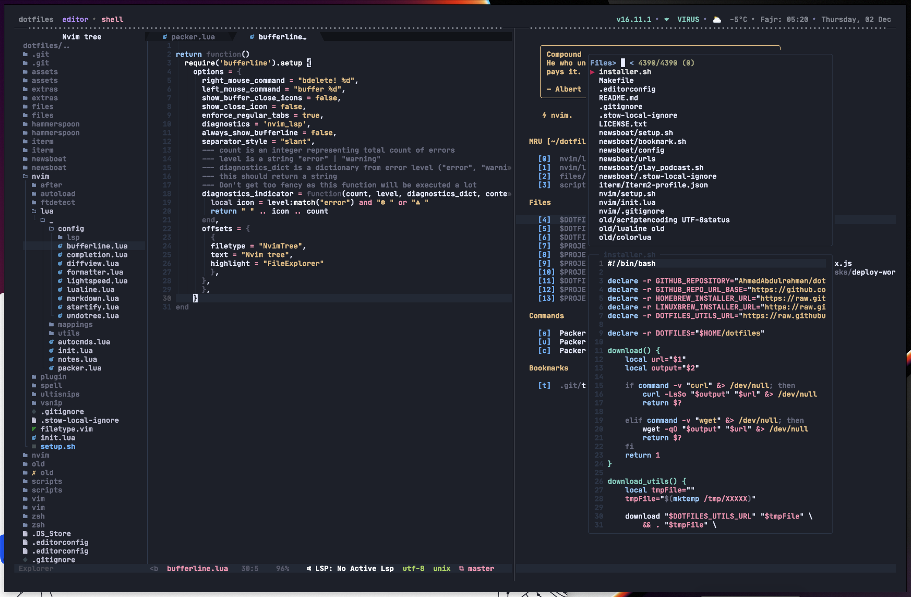

# Ahmed’s dotfiles

[](https://github.com/AhmedAbdulrahman/dotfiles/blob/master/LICENSE.txt)


> Running [**iTerm2**](https://www.iterm2.com/) with custom [**Spaceship-zsh**](https://github.com/denysdovhan/spaceship-zsh-theme) theme.

The color scheme is [**Aylin**](https://github.com/AhmedAbdulrahman/aylin-iterm-theme) for _iTerm2_ and the font is [**JetBrains Mono**](https://www.jetbrains.com/lp/mono/) with [**Nerd Fonts**](https://github.com/ryanoasis/nerd-fonts) as `Non-ASCII Font`



Table of Contents
-----------------

  * [💡What's it](#whats-it)
  * [📦What's inside](#whats-inside)
  * [🔧Setup](#setup)
  * [💄Customize](#customize)
    * [🌐 Local Settings](#local-settings)
      * [🐚`~/.zshrc.local`](#zshrclocal)
      * [🔁`~/.gitconfig.local`](#gitconfiglocal)
      * [⌨️ `~/.vimrc.local`](#vimrclocal)
  * [📚Resources](#resources)
  * [📄License](#license)

What's it
----------
This is where I keep all my dotfiles and configs, and as well as all the tools I commonly use. Every time I set up a new OS X machine I can execute a single command to `bootstrap` a new system and pull down all of my dotfiles and configs.

What's inside
-------------
A lot of stuff and you can check them out in the file browser above. Main components are:

- [`Homebrew`](https://brew.sh/): Used for managing and installing macOS dependencies and [`Cask`](https://github.com/caskroom/homebrew-cask) for managing and installing GUI apps like Chrome, Firefox, VSCode,...etc.
- [`Tmux`](http://tmux.sourceforge.net/): Used for pane and window management, copy-mode for navigating output, and session management make it a no-brainer for those who live in the terminal (and especially vim)
  
- [`Neovim`](https://neovim.io): A drop-in replacement for Vim with my own customizations applied.
- [`ZSH`](http://www.zsh.org/): Shell with various customization`:
  - [`🚀Spaceships ZSH`](https://github.com/denysdovhan/spaceship-prompt) as a prompt.
  - [`🌺ZPLUG`](https://zplug.sh) for dependency management.
  - ⚡️ Power up and beautify terminal with [`ZSH completions`](zsh/completions).
  - 💄 Syntax highlighting of commands.
  - 🏎 Autosuggestions for most of commands.
  - 🕵️‍ Fuzzy Finder for VIM, Git and ZSH
  - ⌨️  ZSH [`VIM`](zsh/config/mappings.zsh) bindings for VIM nerds.
  - 🛸 Useful [`aliases`](zsh/config/aliases.zsh).
  - 🛠 Custom [`Git config`](files/.gitconfig), global [`.gitignore`](files/.config/git/.gitignore) file and aliases.
- [`Hammerspoon`](https://www.hammerspoon.org/): a MacOS automation solution  using Lua to solve interesting problems in an easy way
- [`Newsboat`](https://newsboat.org/): an **RSS** feed reader for the text terminals.
- [`Files`](files): directory where all extra configs live that will be symlink into your `$HOME`.
- [`Extras/bin`](extras/bin): Anything in bin will get added to your `$PATH` and be made available everywhere.

Missing feature? 🍴 Fork this repo and make it better ❤️

Setup
-----

#### ⚠️ Disclaimer! ⚠️
**DO NOT** just run the `installer` snippet if you do not fully understand [what it does](./installer.sh)!

To set up the my `dotfiles`, run the appropriate snippet in the terminal:

| Downloader | Snippet                                                                                                   |
| :--------- | :-------------------------------------------------------------------------------------------------------- |
| `curl`     | `bash -c "$(curl -fsSL https://raw.githubusercontent.com/AhmedAbdulrahman/dotfiles/master/installer.sh)"` |
| `wget`     | `bash -c "$(wget https://raw.githubusercontent.com/AhmedAbdulrahman/dotfiles/master/installer.sh -O -)"`  |
| `git`      | `git clone git@github.com:AhmedAbdulrahman/dotfiles.git ~/dotfiles && source ~/dotfiles/installer.sh`     |

By default it will Install `Personal` prefered stuff, for `Work` related stuff you need to pass `work` as an argument to the `snippet` :
```bash
bash -c "$(curl -fsSL https://raw.githubusercontent.com/AhmedAbdulrahman/dotfiles/master/installer.sh)" work
```

That's it! 🎉. When `installer` is run, you are prompted to choose one option from the list as seen below:

```bash
    What you want to do?

    1) All                        6) Install macOS Apps
    2) Install package manager    7) Override macOS System Settings
    3) Install Git and Setup SSH  8) Change shell
    4) Clone Ahmeds dotfiles      9) Install XCode tools
    5) Symlink files             10) Quit

    Enter your choice (must be a number):               # Choose a number
```
The installer attempts to only select relevant script based on your choice. Say you choose `1` for `All`, then the process does a few things:

* Download `Homebrew` our main macOS dependency manager.
* Install Git if it's not installed in your machine.
* Install `ZSH` shell and set it as primary shell for your terminal.
* Clone my `dotfiles` repo on your computer (by default it will suggest `~/dotfiles`).
* Create some additional [directories][dirs].
* Symlink [`zsh`](zsh), [`vim`](vim), [`tmux`](tmux), [`files`](files), [`newsboat`](newsboat), [`extras/bin`](extras/bin) files.
* Install applications and command-line tools for [`macOS`](scripts/brew.zsh), [`Nodejs`](scripts/nodejs.zsh) including global packages, and [`Python`](scripts/python-packages.zsh) packages.
* Set custom [`macOS`](extras/macos/.macos) preferences.
* Install [`vim plugins`](vim/pack/bundle/start) as [`Git Submodules`](https://git-scm.com/book/en/v2/Git-Tools-Submodules), and [`zsh plugins`](zsh/config/zplug.zsh).

Customize
---------

### Local Settings

My `dotfiles` config can be easily extended to suit additional local
requirements by using the following files:

#### `~/.zshrc.local`

You can add or overwrite any existing aliases, settings, `PATH`, ... etc for `zsh` by adding `~/.zshrc.local` file to your `$HOME` dir, and it will be automatically sourced after all the other `zsh`.

```bash
#!/usr/bin/env zsh

# Example: Set local aliases.
alias vim="nvim"

# Set PATH additions.
PATH="$PATH:$HOME/projects/dotfiles/src/bin" # Here we are adding bin directory to PATH
export PATH  # Then export it
```

#### `~/.gitconfig.local`

You can use `~/.gitconfig.local` file to store sensitive information such as your git credentials and this file will be automatically included after the configurations from `~/.gitconfig`.

```bash
[user]

    name = Ahmed Abdulrahman
    email = account@example.com
    signingkey = XXXXXXXX
```

#### `~/.vimrc.local`

You can add or overwrite any `vim` settings you want by adding `~/.vimrc.local` file to your `$HOME` dir and it will be automatically sourced after `~/.vimrc`.

Resources
---------

This repo is inspired and influenced by

- GitHub 💞 [`dotfiles`](http://dotfiles.github.io/)
- Niclas Pahlfer’s [`dotfiles`](https://github.com/Npahlfer)
- Mathias Bynens’ [`dotfiles`](https://github.com/mathiasbynens/dotfiles)
- Paul Irish’s [`dotfiles`](https://github.com/paulirish/dotfiles)
- Denys Dovhan’s [`dotfiles`](https://github.com/denysdovhan/dotfiles)
- Adam Eivy’s [`dotfiles`](https://github.com/atomantic/dotfiles)
- Matthew J Morrison’s [`dotfiles`](https://github.com/mattjmorrison/dotfiles)

License
-------
Copyright © 2020 Ahmed Abdulrahman
Licensed under the MIT [`license`](LICENSE.txt).
