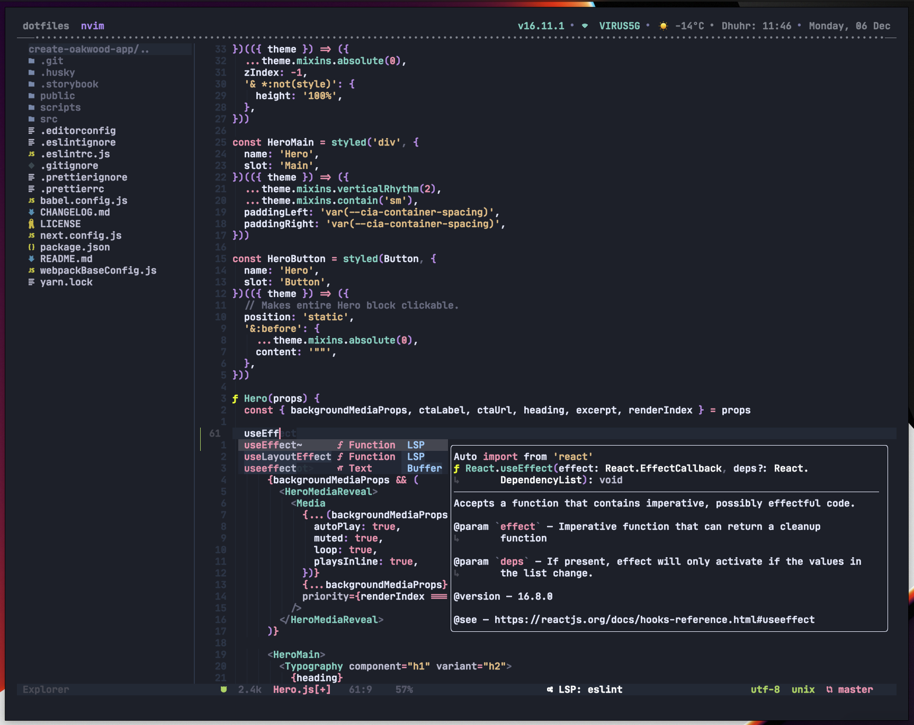
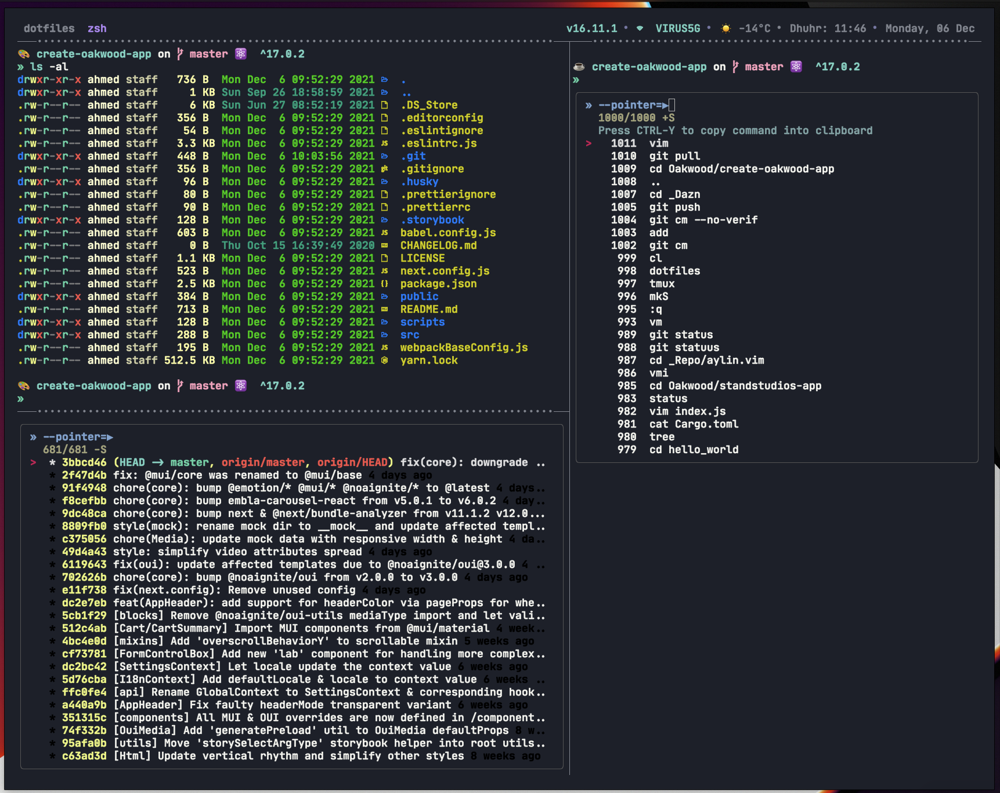
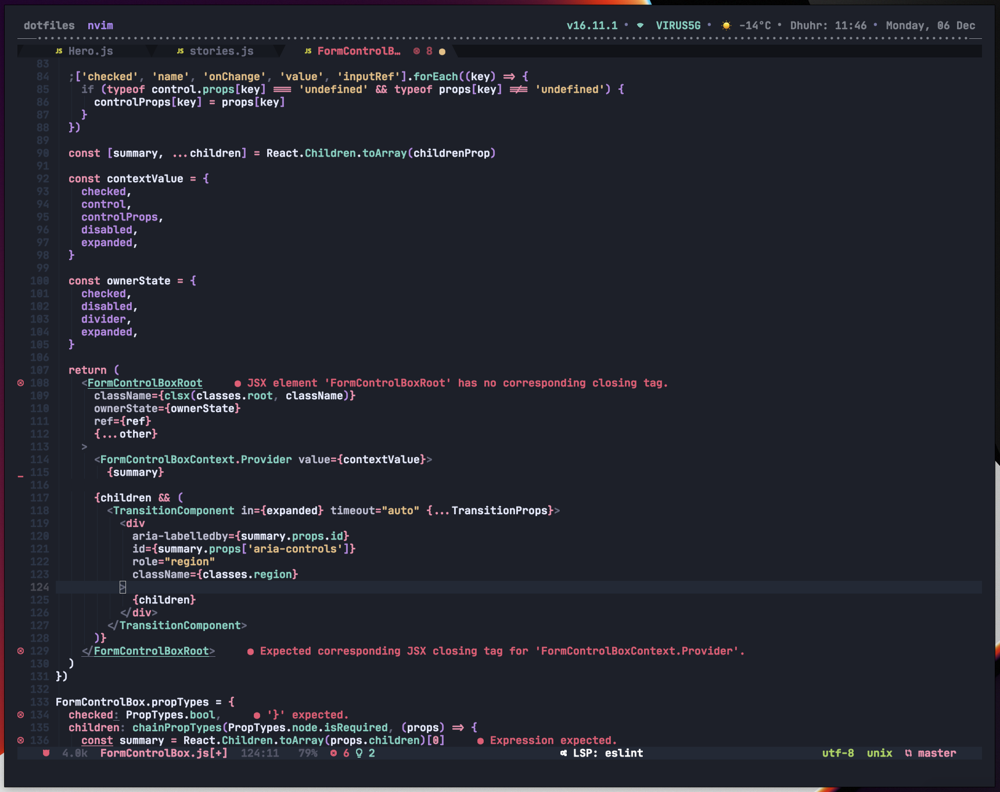

# `Ahmed’s dotfiles` [](https://github.com/AhmedAbdulrahman/dotfiles/actions/workflows/luacheck.yml)

> ⚠️ Disclaimer! ⚠️
>
> Please **DO NOT** blindly copy or run the `installer` snippet if you do not fully understand [what it does](./installer.sh)!. I use this place as a backup :)
>
> Feel free to take whatever you want, though.

[](https://github.com/AhmedAbdulrahman/dotfiles/blob/master/LICENSE.txt)


> Running [**kitty**](https://sw.kovidgoyal.net/kitty/) with custom [**Spaceship-zsh**](https://github.com/denysdovhan/spaceship-zsh-theme) theme.

The font is [**JetBrains Mono**](https://www.jetbrains.com/lp/mono/)


|  |  |  |
| ----------------------------------------------------------------------------------------------------------------------- | ------------------------------------------------------------------------------------------------------------------------ | ------------------------------------------------------------------------------------------------------------------------ |

## Table of Contents

- [`Ahmed’s dotfiles` ](#ahmeds-dotfiles-)
	- [Table of Contents](#table-of-contents)
	- [What's it](#whats-it)
	- [What's inside](#whats-inside)
	- [Setup](#setup)
	- [Customize](#customize)
		- [Local Settings](#local-settings)
			- [`~/.zshrc.local`](#zshrclocal)
			- [`~/.gitconfig.local` and `~/.vimrc.local`](#gitconfiglocal-and-vimrclocal)
	- [Resources](#resources)
	- [License](#license)

## What's it

This is where I keep all my dotfiles and configs, and as well as all the tools I commonly use. Every time I set up a new OS X machine I can execute a single command to `bootstrap` a new system and pull down all of my dotfiles and configs.

## What's inside

A lot of stuff and you can check them out in the file browser above. Main components are:

-   [`Homebrew`](https://brew.sh/): Used for managing and installing macOS dependencies and [`Cask`](https://github.com/caskroom/homebrew-cask) for managing and installing GUI apps like Chrome, Firefox, VSCode,...etc.
-   [`Tmux`](http://tmux.sourceforge.net/): Used for pane and window management, copy-mode for navigating output, and session management make it a no-brainer for those who live in the terminal (and especially vim)
    
-   [`Neovim`](https://neovim.io): A drop-in replacement for Vim with my own customizations applied.
    -   [`aylin`](https://github.com/AhmedAbdulrahman/aylin.vim) - Aylin a modern and minimal VIM dark theme with bright colors.
    -   [`autopairs`](https://github.com/windwp/nvim-autopairs) - Auto pair plugin
    -   [`bufferline`](https://github.com/akinsho/bufferline.nvim) - A snazzy bufferline for Neovim
    -   [`bufdel`](https://github.com/ojroques/nvim-bufdel) - A Neovim plugin to improve buffer deletion
    -   [`bqf`](https://github.com/kevinhwang91/nvim-bqf) - Better quickfix window in Neovim, polish old quickfix window
    -   [`cmp`](https://github.com/hrsh7th/nvim-cmp) - Auto completion support
        -   [`cmp-buffer`](https://github.com/hrsh7th/cmp-buffer) - cmp source for buffer words
        -   [`cmp-emoji`](https://github.com/hrsh7th/cmp-emoji) - cmp source for emoji
        -   [`cmp-lsp`](https://github.com/hrsh7th/cmp-nvim-lsp) - cmp source for LSP clent
        -   [`cmp-conjure`](https://github.com/PaterJason/cmp-conjure) - cmp source for conjure
        -   [`cmp-luasnip`](https://github.com/saadparwaiz1/cmp_luasnip) - cmp source for luasnip snippets
        -   [`cmp-path`](https://github.com/hrsh7th/cmp-path) - cmp source for filesystem paths
        -   [`cmp-spell`](https://github.com/f3fora/cmp-spell) - cmp source for spell
        -   [`cmp-cmdline`](https://github.com/hrsh7th/cmp-cmdline) - cmp source for cmdline
        -   [`cmp-calc`](https://github.com/hrsh7th/cmp-calc) - cmp source for calc
        -   [`cmp-tmux`](https://github.com/andersevenrud/cmp-tmux) - cmp source for tmux
    -   [`fzf-lua`](https://github.com/ibhagwan/fzf-lua) - Lua implementation of fuzzy finder fzf plugin
    -   [`formatter`](https://github.com/mhartington/formatter.nvim) - A format runner for neovim, written in lua
    -   [`indent-blankline`](https://github.com/lukas-reineke/indent-blankline.nvim) - Display the indention levels with thin vertical lines
    -   [`colorizer`](https://github.com/norcalli/nvim-colorizer.lua) - High-performance color highlighter
    -   [`filetype`](https://github.com/nathom/filetype.nvim) - A faster version of filetype.vim
    -   [`gitsigns`](https://github.com/lewis6991/gitsigns.nvim) - Asynchronous git diff in sign column
    -   [`github-hub`](https://github.com/jez/vim-github-hub) - A Vim filetype plugin for github/hub
    -   [`conflict-marker`](https://github.com/rhysd/conflict-marker.vim) - Weapon to fight against conflicts in Vim
    -   [`fugitive`](https://github.com/tpope/vim-fugitive) - Git client
    -   [`git-messenger`](https://github.com/rhysd/git-messenger.vim) - Vim and Neovim plugin to reveal the commit messages under the cursor
    -   [`diffview`](https://github.com/sindrets/diffview.nvim) - Single tabpage interface for all modified files in git
    -   [`plenary`](https://github.com/nvim-lua/plenary.nvim) - Asynchronous modules using coroutines
    -   [`twig`](https://github.com/evidens/vim-twig) - Twig syntax highlighting, snipMate, etc
    -   [`sexp`](https://github.com/guns/vim-sexp) - Precision Editing for S-expressions
    -   [`lspconfig`](https://github.com/neovim/nvim-lspconfig) - Quickstart configurations for the neovim LSP client
    -   [`lsp-colors`](https://github.com/folke/lsp-colors.nvim) - Create missing LSP diagnostics highlight groups for color schemes
    -   [`trouble`](https://github.com/folke/trouble.nvim) - A pretty diagnostics, references, telescope results
    -   [`typescript-language-server`](https://github.com/theia-ide/typescript-language-server) - TypeScript & JavaScript Language Server
    -   [`css-language-server`](https://github.com/vscode-langservers/vscode-css-languageserver-bin) - CSS Language Server
    -   [`html-language-server`](https://github.com/vscode-langservers/vscode-html-languageserver-bin) - HTML Language Server
    -   [`json-language-server`](https://github.com/vscode-langservers/vscode-json-languageserver) - JSON Language Server
    -   [`lua-language-server`](https://github.com/sumneko/lua-language-server) - Lua Language Server
    -   [`luasnip`](https://github.com/L3MON4D3/LuaSnip) - High-performance snippet engine
        -   [`friendly-snippets`](https://github.com/rafamadriz/friendly-snippets) - Snippets collection for a set of different programming languages for faster development
    -   [`lualine`](https://github.com/nvim-lualine/lualine.nvim) - A blazing fast and easy to configure neovim statusline plugin written in pure lua
    -   [`playground`](https://github.com/nvim-treesitter/playground) - Treesitter playground integrated into Neovim
    -   [`nvim-treesitter`](https://github.com/nvim-treesitter/nvim-treesitter) - Nvim Treesitter configurations and abstraction layer
    -   [`orgmode`](https://github.com/kristijanhusak/orgmode.nvim) - Orgmode clone written in Lua for Neovim 0.5+
    -   [`nvim-tree`](https://github.com/kyazdani42/nvim-tree.lua) - File explorer
    -   [`nvim-web-devicons`](https://github.com/kyazdani42/nvim-web-devicons) - Nerd Font icon API support
    -   [`nvim-fzf`](https://github.com/vijaymarupudi/nvim-fzf) - Asynchronous Lua API for using fzf
    -   [`vim-easydir`](https://github.com/duggiefresh/vim-easydir) - create, edit and save files and parent directories
    -   [`startify`](https://github.com/mhinz/vim-startify) - 🔗 The fancy start screen for Vim.
    -   [`markdown`](https://github.com/plasticboy/vim-markdown) - Markdown Vim Mode
    -   [`markdown-preview`](https://github.com/iamcco/markdown-preview.nvim) - Markdown preview plugin for (neo)vim
    -   [`polyglot`](https://github.com/sheerun/vim-polyglot) - Big collection of language packs as scripts are loaded only on demand
    -   [`undotree`](https://github.com/mbbill/undotree) - The undo history visualizer for VIM
    -   [`eunuch`](https://github.com/tpope/vim-eunuch) - Helpers for UNIX
    -   [`sexp`](https://github.com/tpope/vim-sexp-mappings-for-regular-people) - Vim-sexp mappings for regular people
    -   [`conjure`](https://github.com/Olical/conjure) - Interactive evaluation for Neovim (Clojure, Fennel, Janet, Racket, Hy, MIT Scheme, Guile)
    -   [`loupe`](https://github.com/wincent/loupe) - Enhanced in-file search for Vim
    -   [`repeat`](https://github.com/tpope/vim-repeat) - Enable repeating supported plugin maps with "."
    -   [`apathy`](https://github.com/tpope/vim-apathy) - Set the 'path' option for miscellaneous file types
    -   [`symbols-outline`](https://github.com/simrat39/symbols-outline.nvim) - A tree like view for symbols in Neovim
    -   [`tmux-navigator`](https://github.com/christoomey/vim-tmux-navigator) - Seamless navigation between tmux panes and vim splits
    -   [`abolish`](https://github.com/tpope/tpope-vim-abolish) - Easily search for, substitute, and abbreviate multiple variants of a word
    -   [`visual-star-search`](https://github.com/nelstrom/vim-visual-star-search) - Start a \* or # search from a visual block
    -   [`lightspeed`](https://github.com/ggandor/lightspeed.nvim) - Next-generation motion plugin with incremental input processing
    -   [`package-info`](https://github.com/vuki656/package-info.nvim) - The set of npm/yarn commands
    -   [`peekaboo`](https://github.com/junegunn/vim-peekaboo) - Peekaboo extends " and @ in normal mode and <CTRL-R> in insert mode so you can see the contents of the registers
-   [`ZSH`](http://www.zsh.org/): Shell with various customization`:
    -   [`🚀Spaceships ZSH`](https://github.com/denysdovhan/spaceship-prompt) as a prompt.
    -   [`🌺ZPLUG`](https://zplug.sh) for dependency management.
    -   ⚡️ Power up and beautify terminal with [`ZSH completions`](zsh/completions).
    -   💄 Syntax highlighting of commands.
    -   🏎 Autosuggestions for most of commands.
    -   🕵️‍ Fuzzy Finder for VIM, Git and ZSH
    -   ⌨️ ZSH [`VIM`](zsh/config/mappings.zsh) bindings for VIM nerds.
    -   🛸 Useful [`aliases`](zsh/config/aliases.zsh).
    -   🛠 Custom [`Git config`](files/.gitconfig), global [`.gitignore`](files/.config/git/.gitignore) file and aliases.
-   [`Hammerspoon`](https://www.hammerspoon.org/): a MacOS automation solution using Lua to solve interesting problems in an easy way
-   [`Newsboat`](https://newsboat.org/): an **RSS** feed reader for the text terminals.
-   [`Files`](files): directory where all extra configs live that will be symlink into your `$HOME`.
-   [`Extras/bin`](extras/bin): Anything in bin will get added to your `$PATH` and be made available everywhere.

Missing feature? 🍴 Fork this repo and make it better ❤️

## Setup

To set up the my `dotfiles`, run the appropriate snippet in the terminal:

| Downloader | Snippet                                                                                                   |
| :--------- | :-------------------------------------------------------------------------------------------------------- |
| `curl`     | `bash -c "$(curl -fsSL https://raw.githubusercontent.com/AhmedAbdulrahman/dotfiles/master/installer.sh)"` |
| `wget`     | `bash -c "$(wget https://raw.githubusercontent.com/AhmedAbdulrahman/dotfiles/master/installer.sh -O -)"`  |
| `git`      | `git clone git@github.com:AhmedAbdulrahman/dotfiles.git ~/dotfiles && source ~/dotfiles/installer.sh`     |

By default it Installs `Personal` prefered stuff, for `Work` related stuff you need to pass `work` as an argument to the `snippet`:

```bash
bash -c "$(curl -fsSL https://raw.githubusercontent.com/AhmedAbdulrahman/dotfiles/master/installer.sh)" work
```

That's it! 🎉. When `installer` is run, you are prompted to choose one option from the list as seen below:

```bash
    What you want to do?

    1) All                        6) Install macOS Apps
    2) Install package manager    7) Override macOS System Settings
    3) Install Git and Setup SSH  8) Change shell
    4) Clone Ahmeds dotfiles      9) Install XCode tools
    5) Symlink files             10) Quit

    Enter your choice (must be a number):               # Choose a number
```

The installer attempts to only select relevant script based on your choice. Say you choose `1` for `All`, then the process does a few things:

-   Download `Homebrew` our main macOS dependency manager.
-   Install Git if it's not installed in your machine.
-   Install `ZSH` shell and set it as primary shell for your terminal.
-   Clone my `dotfiles` repo on your computer (by default it will suggest `~/dotfiles`).
-   Create some additional [directories][dirs].
-   Symlink [`zsh`](zsh), [`vim`](vim), [`tmux`](tmux), [`files`](files), [`newsboat`](newsboat), [`extras/bin`](extras/bin) files.
-   Install applications and command-line tools for [`macOS`](scripts/brew.zsh), [`Nodejs`](scripts/nodejs.zsh) including global packages, and [`Python`](scripts/python-packages.zsh) packages.
-   Set custom [`macOS`](extras/macos/.macos) preferences.
-   Install [`vim plugins`](vim/pack/bundle/start) as [`Git Submodules`](https://git-scm.com/book/en/v2/Git-Tools-Submodules), and [`zsh plugins`](zsh/config/zplug.zsh).

## Customize

### Local Settings

My `dotfiles` config can be easily extended to suit additional local
requirements by using `*.local` files which will be created using `installer` script

#### `~/.zshrc.local`

You can add or overwrite any existing aliases, settings, `PATH`, ... etc for `zsh` using `~/.zshrc.local` file located in your `$HOME` dir, and it will be automatically sourced after all the other `zsh`. Then you can add your own configs ;)

```bash
#!/usr/bin/env zsh

# Example: Set local aliases.
alias vim="nvim"

# Set PATH additions.
PATH="$PATH:$HOME/projects/dotfiles/src/bin" # Here we are adding bin directory to PATH
export PATH  # Then export it
```

#### `~/.gitconfig.local` and `~/.vimrc.local`

Same goes for `git` and `vim`. You can add or overwrite your custom config to `~/.gitconfig.local` file including your sensitive information such as your `git credentials` and this file will be automatically included after the configurations from `~/.gitconfig`.

```bash
[user]

    name = Ahmed Abdulrahman
    email = account@example.com
    signingkey = XXXXXXXX
```

## Resources

This repo is inspired and influenced by

-   GitHub 💞 [`dotfiles`](http://dotfiles.github.io/)
-   Niclas Pahlfer’s [`dotfiles`](https://github.com/Npahlfer/dotfiles)
-   Mathias Bynens’ [`dotfiles`](https://github.com/mathiasbynens/dotfiles)
-   Paul Irish’s [`dotfiles`](https://github.com/paulirish/dotfiles)
-   Ahmed El Gabri’s [`dotfiles`](https://github.com/ahmedelgabri/dotfiles)
-   Denys Dovhan’s [`dotfiles`](https://github.com/denysdovhan/dotfiles)
-   Adam Eivy’s [`dotfiles`](https://github.com/atomantic/dotfiles)
-   Matthew J Morrison’s [`dotfiles`](https://github.com/mattjmorrison/dotfiles)

## License

Copyright © 2020 Ahmed Abdulrahman
Licensed under the MIT [`license`](LICENSE.txt).
