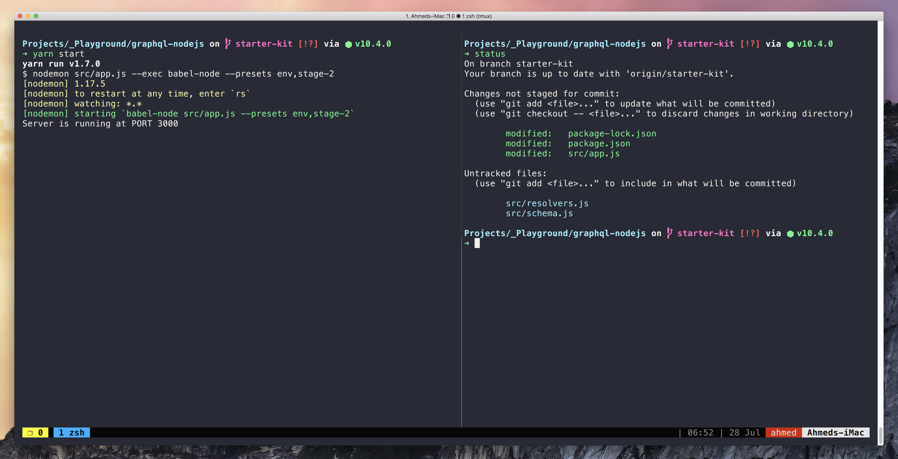

# Ahmed’s dotfiles adapted for ZSH

> Running [**iTerm2**](https://www.iterm2.com/) with [**oh-my-zsh**](https://github.com/robbyrussell/oh-my-zsh) and [**Spaceship-zsh-theme**](https://github.com/denysdovhan/spaceship-zsh-theme).

The color scheme is [**iTerm2 - Snazzy**](https://github.com/sindresorhus/iterm2-snazzy) for _iTerm2_ and the font is [**Fira Code**](https://github.com/tonsky/FiraCode)



## Installation

ZSH Dotfiles are installed by running one of the following commands in your terminal

via `curl`

```bash
  bash -c "$(curl -fsSL https://raw.githubusercontent.com/AhmedAbdulrahman/zsh-dotfiles/master/installer.sh)"
```

via `wget`

```bash
  bash -c "$(wget https://raw.githubusercontent.com/AhmedAbdulrahman/zsh-dotfiles/master/installer.sh -O -)"
 ```
